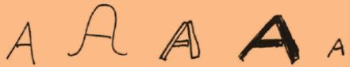

# Takeaways

## How people see

### Vision
- Central vision - Should be used for details.
- Peripheral vision - Area that we are not directly look but we perceive layout or scene.composition

### Pattern recognition
- Your brain want to see pattern. Use spacing and common shapes to express that.
- Facial recognition uses special part of brain outside of visual cortex whose sole purpose is to recognize faces. Faces 'on page' implicitly grabs attention, use frontal view of face if possible.
- They also found that people evalute whether face is human and alive mostly by eyes of that face.

### Cues
- Give people cues what they can do with 'object'. E.g. use shadows for button toggle states.

## How people read
### Words
- All caps is perceived as shouty.
### Text
- There are some readability formulas (e.g. Flesh-Kincaid formula)
- Provideing meaningful title or headlines are the most important things you can do.
### Fonts
- People identify letters through pattern recognition

- decorative fonts interfere with pattern recognition
- if text is hard to read, people also transfer that feeling onto real subject/meaning of that text (e.g. some task description)
- fonts with larger x-height are easier to read

- people read longer lines faster but prefer shorter line length. If text content is important, use shorter lines (45-72) otherwise people wil not stick around it for long.

## How people remember
- working memory can hold up to 3-4 items very effectively. Therefore try to limit number of choices/links/... to 3-4. If not possible try to group a like items into chunks with max 3-4 items in each group.
- to get information from working to long term memory you can either repeat that information over and over again or you can associate new information with already known schema.
- do not assume that people will remember information. Provide it or make it easy to look it up.

