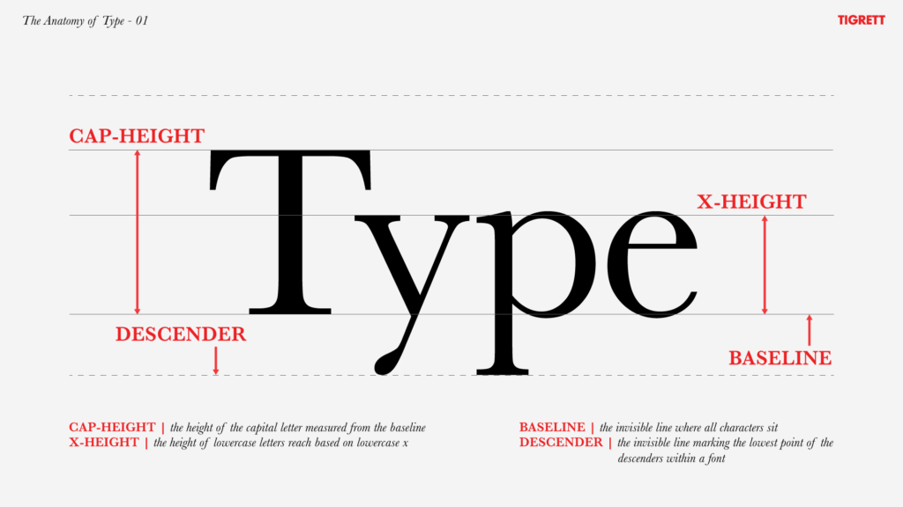

# Takeaways

## How people see

### Vision
- Central vision - Should be used for details.
- Peripheral vision - Area that we are not directly look but we perceive layout or scene.composition

### Pattern recognition
- Your brain want to see pattern. Use spacing and common shapes to express that.
- Facial recognition uses special part of brain outside of visual cortex whose sole purpose is to recognize faces. Faces 'on page' implicitly grabs attention, use frontal view of face if possible.
- They also found that people evaluate whether face is human and alive mostly by eyes of that face.

### Cues
- Give people cues what they can do with 'object'. E.g. use shadows for button toggle states.

## How people read
### Words
- All caps is perceived as shouty.
### Text
- There are some readability formulas (e.g. Flesh-Kincaid formula)
- Providing meaningful title or headlines are the most important things you can do.
### Fonts
- People identify letters through pattern recognition

- decorative fonts interfere with pattern recognition
- if text is hard to read, people also transfer that feeling onto real subject/meaning of that text (e.g. some task description)
- fonts with larger x-height are easier to read

- people read longer lines faster but prefer shorter line length. If text content is important, use shorter lines (45-72) otherwise people will not stick around it for long.

## How people remember
- working memory can hold up to 3-4 items very effectively. Therefore try to limit number of choices/links/... to 3-4. If not possible try to group a like items into chunks with max 3-4 items in each group.
- to get information from working to long term memory you can either repeat that information over and over again or you can associate new information with already known schema.
- do not assume that people will remember information. Provide it or make it easy to look it up.

## How people think
- Do not include all content on one page. Use "progressive disclosure" -> show only what user need when they need.
- It is ok to make them click often but only if they find information what they search there.
### Processing load
People are using mental resources that can be divided into 3 groups (order by most "expensive")
1. Cognitive (thinking/remembering)
2. Visual
3. Motoric

When designing you will need to make tradeoffs between those 3. Try to decrease load on user by using lower resource category load. It is ok to make user click 10 times if each step is simple a clear and they do not need to think and feels progress/satisfaction.

### Mental vs conceptual model
- mental model defines what user expects product to look like or to be interacted with. Many times mental models are created/shaped from previous experiences.
- conceptual model represents reality (how product was designed to be interacted with)
- if you make sure that these two models match as much as possible then you will create positive user feedback/experience.

## How people focus their attention
If it is critical to pay attention to information. Make information stand up 10 times more than you think is necessary.

If you require person to do sequence repeatedly, make it easy to do, but realize that people can then make errors because they are doing is automatically.

People lose attention/focus very quickly (7-10 minutes). Keep online demos/tutorials under this limit. If not possible give break or introduce novel information.

### Things that grabs attention
- anything that moves
- pictures of human faces, food, sex or danger
- stories
- loud noises

Idea of having 3 brains.
- new (conscious, reasoning, logic)
- mid (emotions)
- old (Can I eat it? Can I have sex with it ? Will it kill me ?

You can not resist to look at food do you ?

## What motivates people
Shorter the distance to the goal the more motivated people are to reach it. You can get illusion of progress to motivate people (loyalty coffee card example).

Best reinforcement (reward) system is the one with variable ratio (the number of action to reward is variables but it averages to certain number).

Dopamine makes you curious about ideas and fuels you to search more. Dopamine is also stimulated by unpredictability, this is used by many platforms to keep you engaged (you do not know when exactly or in which form tweet/email/... arrives so it will make you click again and again).

## People are social animals

